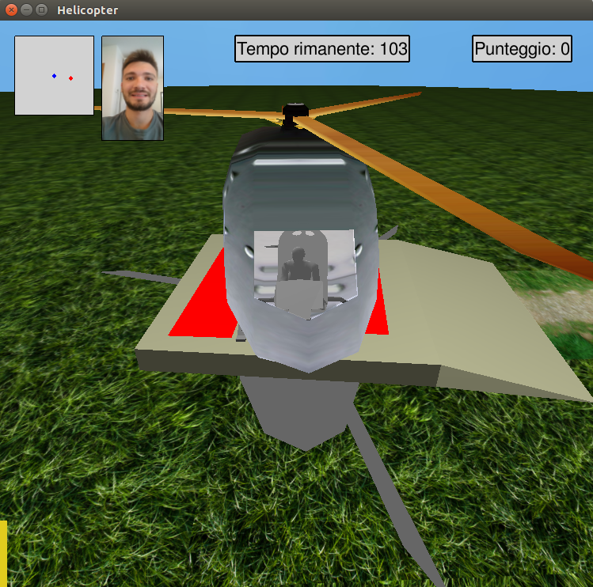

# Helicopter
3D game, project for computer graphics course.

<head>
<link href="stile.css" rel="stylesheet" type="text/css">
</head>

<body>
<h1 id="titolo">HELICOPTER</h1>
<h2 id="Sottotitolo">Realizzato da Imerio Spagnuolo</h2>

<ul class="menu">
  	<li class="menu"><a href="#intro">Introduzione</a></li>
  	<li class="menu"><a href="#purpose">Scopo del gioco</a></li>	
  	<li class="menu"><a href="#genesis">Genesi del gioco</a></li>
	<li class="menu"><a href="#controlli">Controlli</a></li>
	<li class="menu"><a href="#game_over">Game over</a></li>
	<li class="menu"><a href="#conclusioni">Conclusioni</a></li>
  	<li style="float:right"><a class="active" href="#info">Info</a></li>
  	<li style="float:right"><a class="active" href="https://www.dropbox.com/s/5zrgf12b1rh4baa/spagnuolo.tar.gz?dl=0">Download</a></li>
</ul>
 

HELICOPTER è un videogioco 3D in terza persona sviluppato in C++ mediante l'ausilio delle librerie
openGL ed SDL2 in ambiente LINUX.
Per eseguire il gioco bisogna installare i seguenti pacchetti: libsdl2-dev, libsdl2-ttf-dev, libsdl2-image-dev.
Tale gioco è il progetto finale presentato per l'esame di Computer Graphic, AA 2015/2016, del prof.
Giulio Casciola del corso di laurea in Ingegneria Informatica dell'Università degli Studi di Bologna Alma Mater Studiorum.

 

<a href="./images/sfera1.png" target="_blank"></img></a>
<a href="./images/sfera2.png" target="_blank"></img></a>
<a href="./images/sfera3.png" target="_blank"></img></a>

<h2 id="purpose">Scopo del gioco</h2>

Il giocatore deve guidare un elicottero e colpire dei bersagli per poter accumulare punti entro un determinato periodo di tempo. La posizione iniziale dell'elicottero è il centro della scena (dove risiede anche un piccolo eliporto). L'utente
può esplorare lo scenario facendo volare l'elicottero oppure modificando la Camera con il tasto F1. 
All'inizio, in una posizione casuale, appare una sfera gialla con uno Smile disegnato sopra.
Nel momento in cui l'elicottero colpisce la sfera, viene assegnato un punto e compare una nuova sfera in un alto punto dell'ambiente.
In alto a sinistra è presente una minimappa in cui viene visualizzata la posizione dell'elicottero (pallino blu) e quella della sfera (pallino rosso). Di tanto in tanto insieme alla sfera gialla ne compare un'altra rossa. La quale, se catturata, decrementa il punteggio e nella minimappa diventerà il nuovo target. Inoltre, ogni tanto, comparirà anche una seconda sfera gialla più piccolina che attribuisce il doppio dei punti, chiaramente tale sfera non comparirà nella minimappa. 
In basso a sinistra è presente una barra gialla che mostra i fps al secondo raggiunti
(vuota per 0 fps e piena per 100 fps). Di fianco la minimappa è presente un selfie del programmatore del gioco.
In alto a destra dello schermo, invece, viene mostrato il punteggio raggiunto fino a quel momento ed i secondi mancanti allo scadere del tempo.
 A tempo scaduto comparirà una schermata di game over che mostra il punteggio ottenuto.

<h2 id="genesis">Genesi del gioco</h2>

Per realizzare il videogioco si è partiti dal Progetto Car mostrato a lezione.
I passi della realizzazione sono stati i seguenti:
<ol>
	<li>Sostituzione della mesh da macchina ad elicottero</li>
	<li>Creazione della classe Helicopter con la gestione della fisica e del rendering della mesh</li>
	<li>Creazione della classe Sphere contenente il rendering della sfera</li>
	<li>Aggiunta di oggetti vari nell'ambiente di gioco</li>
	<li>Applicazione di texture</li>
	<li>Gestione dell'illuminazione</li>
	<li>Gestione delle ombre</li>
	<li>Gestione della telecamera</li>
</ol>

<h3 id="mesh">Sostituzione della mesh da macchina ad elicottero</h3>

La mesh dell'elicottero è stata scaricata da internet nel formato <b>OBJ</b> ed è stata importata sul software <b>BLENDER</b>, attraverso cui si è reso possibile separare le varie componenti dell'elicottero in più mesh: una per l'elica superiore, una per l'elica posteriore, una per la carlinga ed una per la base. Inoltre, modellando la carlinga in maniera opportuna, si è riuscito a realizzare una porta di ingresso, i vetri laterali e frontale. Di seguito immagini della mesh orginale e quella ottenuta dopo la modellazione.

 

<a href="./images/elicotteroOriginale.png" target="_blank">	</img></a>
<a href="./images/elicotteroFinale.png" target="_blank">	</img></a>

 

<h3 id="Elicottero">Creazione della classe Helicopter con la gestione della fisica e del rendering della mesh</h3>

La classe Helicopter è ispirata alla classe Car del progetto Car visto a lezione. Essa è caratterizzata da una serie di variabili che indicano la posizione ed orientamento corrente (px,py,pz e facing), la velocità attuale, l'accelerazione, gli attriti con l'atmosfera e la velocità di quota, inoltre, vi sono i metodi di rendering e dell'implementazione della fisica necessaria per far muovere l'elicottero. 
Attraverso i metodi <b>glRotate</b> e <b>glTranslate</b> e la variabile mozzo, la quale decrementa in maniera dinamica, è stato possibile far muovere le eliche. Per l'elica superiore è bastato farla ruotare intorno l'asse Y, mentre per l'elica posteriore oltre a farla ruotare lungo un determinato asse, X, bisogna anche traslarla intorno al proprio centro, questo perchè quest'ultima non ruota attorno ad un asse principale. 
Nel metodo doStep() viene calcolata la nuova posizione che dovrà avere l'elicottero dopo aver digitato un comando (ad esempio salire di quota e/o andare avanti), inoltre avvengono determinati controlli che permettono all'elicottero di non sprofondare nel terreno, non uscire al di fuori dell'ambiente esplorabile e di impedire il movimento se si trova ancorato al terreno. Le eliche superiori e posteriori si muovono solo quando l'elicottero inizia a prendere quota, se si trova a terra esse si fermano, in modo tale da simulare l'accensione e lo spegnimento del motore. Alle mesh della carlinga e delle eliche sono state inserite delle texture, scaricate dal sito <b>textures.com</b>, le cui coordinate sono state fatte generare in maniera automatica da openGL. 
Infine, dopo che sono stati aggiunti vari oggetti al mondo (come il tabellone pubblicitario e l'eliporto), è stato implementato un metodo che controllasse le collisioni. Per la collisione con il tabellone si è confrontato la posizione attuale dell'elicottero con il bounding box del rettangolo opportunatamente traslato nella posizione corretta, processo simile per la collisione con l'eliporto.

Dopo aver creato l'elicottero, e testato il corretto funzionamento, è stata generata una mesh poligonale che rappresentasse l'eliporto. Essa è stata creata su <b>Blender</b>, modellando un cubo ed un piano. Attraverso il metodo <b>glColor</b> di openGL è stato possibile colorare di rosso l'H presente sopra il cubo per ottenere l'effetto finale mostrato in figura.

 

<a href="./images/eliporto.png" target="_blank">	</img></a>
<a href="./images/eliportoGioco.png" target="_blank"> </img></a>

 

Per rendere l'elicottero più realistico è stato pensato di aggiungere qualche oggetto internamente. Dal sito <b>turbosquid</b> sono state scaricate due mesh: un sedile ed una persona. Quest'ultima è stata importata su <b>blender</b> e modificata per farla "sedere" sul sedile con un braccio abbassato ed un'altro teso in avanti come se stesse pilotando l'elicottero. Per completare gli interni è stata creata un'altra mesh che rappresenta il pannello dei comandi, ottenuta modellando un piccolo piano. Per poter far notare la presenza degli interni è stata applicata della <b>trasparenza</b> sul vetro anteriore. Per renderlo trasparente è stato utilizzato il metodo <b>glColor</b> con il parametro alfa ed abilitato il blending con il metodo <b>glEnable(GL_BLEND)</b> ed utilizzando la seguente proprietà <b>glBlendFunc(GL_SRC_ALPHA, GL_ONE_MINUS_SRC_ALPHA)</b>. Di seguito tre immagini che mostrano gli interni.

 

<a href="./images/interni.png" target="_blank">	</img></a>
<a href="./images/elicotteroInterni.png" target="_blank">	</img></a>
<a href="./images/InterniGioco.png" target="_blank">	</img></a>

 

<h3 id="sphere">Creazione della classe Sphere contenente il rendering della sfera</h3>

 

La classe Sphere è stata realizzata per rappresentare il target. Essa è caratterizzata da delle variabili che indicano la posizione corrente, il tipo di target e dal metodo di rendering. Per poter inserire una texture sulla sfera sono state utilizzate le primitive di openGL <b>gluQuadricTexture</b> per indicare l'inserimento di una texture sulla sfera, <b>gluQuadricDrawStyle</b> con il settaggio <b>GLU_FILL</b> per disegnare una sfera piena e <b>gluSphere</b> che disegna effettivamente la sfera nell'ambiente indicando anche la dimensione.
 Inoltre in tale classe avviene il controllo della collisione dell'elicottero con la sfera, in tal caso viene aggiornato il punteggio e la sfera corrente scompare per poter ricomparire in una nuova posizione. La variabile booleana isShowing viene utilizzata nel main per far comparire come target nella minimappa la sfera distrattrice.

 

<a href="./images/sfera1.png" target="_blank"></img></a>
<a href="./images/sfera2.png" target="_blank"></img></a>
<a href="./images/sfera3.png" target="_blank"></img></a>

 

<h3 id="oggetti">Aggiunta di oggetti vari nell'ambiente di gioco</h3>

 

E' stata creata una classe Objects, la quale si occupa di caricare le mesh e disegnare tutti gli altri oggetti della scena differenti dall'elicottero. Nel metodo Init() vengono create le tre displaylist relative alle luci dei tre lampioni.

 

<h4 id="Terreno">Terreno</h4>

Dopo aver creato l'elicottero e la sfera si è pensato di modellare l'ambiente di gioco. Per prima cosa si è sentita l'esigenza di eliminare la pista presente nel progetto Car, in quanto non è presente una macchina o un oggetto che deve muoversi sul terreno. Dal sito<b> textures.com</b> sono state scaricate 2 texture: una che rappresenta l'erba ed un'altra che raffigura una strada di campagna. 
Il metodo <b>drawFloor()</b> si occupa di creare il terreno, per far ciò si è pensato di suddividere l'ambiente in tanti piccoli piani. Per poter creare un piano quadrato con openGL bisogna innanzitutto eseguire la primitiva <b>glBegin(GL_QUADS)</b> dopodichè si devono indicare i 4 vertici di ogni quads in maniera manuale con il metodo <b>glVertex3d</b> e poi usare la primitiva <b>glEnd()</b>. Ad ogni quads è stata aggiunta la texture dell'erba indicando manualmente le coordinate. Gli unici quads a cui è stata applicata la texture della strada sono quelli che si trovano su una linea lungo l'asse delle X che parte dall'origine sino all'esterno. 
E' stato anche pensato di realizzare un terreno senza texture, con il tasto F3 si passa dalla modalità texture alla modalità colori, ogni quads viene colorato con una sfumatura diversa. 

 

<a href="./images/terrenoTexture.png" target="_blank"></img></a>

<a href="./images/terrenoColori.png" target="_blank"></img></a>

 

<h4 id="Cielo">Cielo</h4>

Il metodo <b>drawSky</b> applica una texture di un cielo ad una sfera, la quale viene generata attraverso il metodo <b>drawSphere</b>. Vengono utilizzate due texture differenti, una che rappresenta il cielo di giorno ed un'altra per la notte. Attraverso il tasto F2 si passa in modalità <b>Wireframe</b>, per far ciò si utilizza il metodo <b>glPolygonMode</b> settato con il parametro <b>GL_LINE</b>.

<h4 id="Tabellone">Tabellone</h4>

Il tabellone è una mesh scaricata dal sito <b>turbosquid.com</b>, la quale è stata importata su <b>Blender</b> e divisa in due file <b>OBJ</b> differenti, uno che indica la struttura ed un altro che indica il rettangolo. E' stata creata un'immagine rettangolare attraverso il software gratuito <b>GIMP</b> in cui vi è una mia foto ed una scritta contenente informazioni sul gioco. Per poter attaccare l'immagine, come texture, al tabellone è stato creato un rettangolo (GL_QUADS), i cui vertici coincidono con il bounding box del tabellone, a cui è stata inserita manualmente la texture indicando come coordinate texture i vertici del rettangolo.

 

<a href="./images/Tabellone.png" target="_blank"></img></a>
<a href="./images/TabelloneTextures.png" target="_blank"></img></a>

 

<h4 id="oggettiScena">Panchina, cestino e Lampione</h4>

Per rendere la scena un pò più realistica si è pensato di aggiungere una panchina, un cestino ed un lampione ripetuti per 3 volte lungo la strada di campagna. 
Le mesh dei 3 oggetti sono state scaricate da internet e caricate su Blender per poterle modellare e dividere in più file <b>OBJ</b>. 
Per il cestino e la panchina è stata inserita una texture lungo le proprie "tegole", composte da un certo numero di rettangoli orizzontali e verticali, mentre per la base si è scelto di colorarle di nero attraverso il metodo <b>glColor3f(0.1,0.1,0.1)</b> di openGL. 
Il lampione, invece, è composto da due mesh, una che rappresenta il palo ed una che rappresenta la struttura in cui è racchiusa la lampadina. 

 

<a href="./images/oggetti.png" target="_blank"></img></a>

 
<h3 id="texture">Applicazione di texture sugli oggetti della scena</h3>

Tutte le texture utilizzate sono state scaricate dal sito <b>textures.com</b>. 
I requisiti del progetto richiedevano di inserire delle texture sia automaticamente che manualmente. Quelle inserite in modo automatico, ovvero senza indicare in maniera esplicita le coordinate, sono quelle applicate alle seguenti mesh: la carlinga dell'elicottero, le due eliche, la porta di ingresso, i due finestrini, le "tegole" delle panchine e dei cestini.
Mentre le texture inserite in modo manuale sono quelle applicate al tabellone, al prato, alla stradina ed al rettangolo con il selfie in alto a sinistra. 
Per poter generare automaticamente le coordinate texture bisogna: abilitare l'uso delle texture attraverso il metodo <b>glEnable(GL_TEXTURES_2D)</b>, abilitare la generazione automatica sugli assi attraverso il metodo <b>glEnable</b> settato con i parametri <b>GL_TEXTURE_GEN_S</b> e <b>GL_TEXTURE_GEN_T</b> ed indicare le opzioni su come si vuol generare le coordinate attraverso il metodo <b>glTexGeni</b> il quale dovrà essere settato con due parametri, uno che indica le coordinate S,T o R ed un altro che indica la modalità con cui dovrà essere generata la funzione che restituisce le coordinate: <b>GL_OBJECT_LINEAR</b>, <b>GL_EYE_LINEAR</b>, <b>GL_SPHERE_MAP</b>, <b>GL_NORMAL_MAP</b> o <b>GL_REFLECTION_MAP</b>. 
Tutte le texture vengono inizializzate nel main attraverso la funzione <b>initTexture()</b> presente nel main. 

<h3 id="illuminazione">Gestione dell'illuminazione</h3>

In tutto vi sono 4 luci all'interno dell'ambiente di gioco, di cui 1 attiva nella modalità giorno e 3 nella modalità notte, attraverso il tasto F5 si passa da una modalità all'altra.
La luce della modalità giorno simula il "sole", quindi deve propagarsi in tutte le direzioni, luce puntiforme, e dev'essere posizionata in alto. Per far ciò si usa la proprietà <b>GL_POSITION</b> applicata alla primitiva <b>glLightfv</b> e passando un vettore che contiene le coordinate x,y e z su dove posizionare la luce ed un valore che indica se dev'essere direzionale o puntiforme. Nel main è definita come <b>GL_LIGHT0</b>, inoltre viene definito anche un vettore di componenti RGBA, differente da quello di default (0,0,0,1) ed aggiunti dei parametri attraverso il metodo <b>glMaterialf</b>.
 Nella modalità notte, invece, la luce GL_LIGHT0 viene disabilitata e si attivano 3 luci differenti, GL_LIGHT1, GL_LIGHT2 e GL_LIGHT3, che rappresentano i 3 lampioni. Tali luci sono caratterizzate da una direzione, sfruttando il parametro <b>GL_SPOT_DIRECTION</b>, e da una serie di parametri come <b>GL_SPOT_CUTOFF</b> e <b>GL_SPOT_EXPONENT</b> per far sì che la luce sia realistica e non influenzi tutta la scena. 
Sono stati anche testati altri parametri come <b>GL_SMOOTH</b> e <b>GL_LINEAR_ATTENUATION</b> per l'attenuazione delle luci. 
Le luci sono state salvate all'interno di displaylist per migliorare le prestazioni.  
Di seguito la scena con una luce "solare" e con le 3 luci dei lampioni.

 

<a href="./images/luce.png" target="_blank"></img></a>
<a href="./images/notte.png" target="_blank"></img></a>

 
<h3 id="ombre">Gestione delle ombre</h3>

Per introdurre le ombre, inizialmente si era pensavo di fare com'è stato implementato sul progetto Car mostrato a lezione, ovvero ridisegnando gli oggetti sul terreno in modo appiattito ma questo poteva andare bene per un'oggetto che si trova appoggiato al terreno. Quindi si è scelto di riutilizzare la procedura che genera la matrice d'ombra 4x4 vista a lezione, la quale verrà moltiplicata, attraverso il metodo <b>glMultMatrixf</b>, al rendering dell'oggetto corrente. In tal modo si ha un ombra più realistica e l'ombra subisce modifiche di dimensione anche in base all'altezza dell'oggetto. Nell'header della classe <b>Objects</b> vi è la funzione <b>glShadowProjection</b> che prende in ingresso la posizione della luce, un punto del piano in cui l'ombra dev'essere proiettata ed il vettore normale al piano e genera la matrice.  Tutte le ombre hanno un colore grigio scuro e sono state aggiunte solo nella modalità giorno. Di seguito due immagini che rappresentano le ombre dei vari oggetti della scena.

 

<a href="./images/Ombre.png" target="_blank"></img></a>
<a href="./images/ombre2.png" target="_blank"></img></a>

 
<h3 id="camera">Gestione della telecamera</h3>

Per la gestione della telecamera viene impostato un metodo <b>setCamera</b> nel main che modifica, all'interno di uno switch i parametri di vista dell'utente per poi passarli al metodo <b>gluLookAt</b>. 
Sono disponibili diversi posizionamenti per la camera: <ul>
<li>CAMERA_BACK_HELICOPTER per una visuale dal retro dell'elicottero</li>
<li> CAMERA_LATERAL_HELICOPTER per una visuale laterale</li>
<li> CAMERA_TOP_HELICOPTER per una visuale dalla parte superiore dell'elicottero</li>
<li> CAMERA_DOWN_HELICOPTER dalla parte inferiore</li>
<li> CAMERA_MOUSE per poter navigare nella scena con il mouse </li>
<li> CAMERA_INTERN_HELICOPTER per una visuale dagli interni in cui si può notare la trasparenza del vetro anteriore.</li>
</ul> Nella telecamera di tipo CAMERA_MOUSE sono stati utilizzati i metodi di <b>glTranslatef</b> e <b>glRotatef</b> sui parametri <b>eyeDist</b>, <b>viewBeta</b> e <b>viewAlpha</b> per poter permettere all'utente di "navigare" nella scena attraverso il mouse. Chiaramente questo è l'unico caso in cui la gluLookAt non viene applicata. 
Di seguito delle immagini delle telecamere dall'alto, dal basso, laterale ed interna.

 

<a href="./images/cameraUp.png" target="_blank"></img></a>
<a href="./images/cameraDown.png" target="_blank"></img></a>

 

<a href="./images/cameraLaterale.png" target="_blank"></img></a>
<a href="./images/cameraInterna.png" target="_blank"></img></a>

 
<h2 id="controlli">Controlli</h2>

Da tastiera è possibile comandare l'elicottero attraverso i seguenti tasti: <ul>
<li>Q - Alzare di quota</li>
<li>E - Abbassare di quota</li>
<li>W - Accelerazione in avanti</li>
<li>S - Accelerazione indietro</li>
<li>A - Gira a sinistra</li>
<li>D - Gira a destra</li>
</ul>
Dalla telecamera "Mouse" è possibile interagire anche usando il mouse con la rotellina e tasto sinistro. 
Per intercettare gli eventi di pressione dei tasti e del mouse ci si è serviti della libreria <b>SDL</b>, la quale permette di creare un ciclo di eventi e gestire i vari tipi di input. Attraverso la primitiva <b>SDL_PollEvent</b> è possibile intercettare determinate tipologie di eventi: <b>SDL_KEYDOWN</b> se si è premuto un tasto, <b>SDL_KEYUP</b> se si rilascia un tasto precedentemente premuto, <b>SDL_WINDOWEVENT</b> se si modificano le dimensioni della finestra di gioco, <b>SDL_QUIT</b> se si è chiusa la finestra, <b>SDL_MOUSEMOTION</b> se si utilizza il mouse, <b>SDL_MOUSEWHEEL</b> se si utilizza la rotellina del mouse. Esistono anche metodi che intercettano eventi scaturiti da un joystick come <b>SDL_JOYAXISMOTION</b> e <b>SDL_JOYBUTTONDOWN</b> ma non avendo un joystick a disposizione non sono state utilizzate. 
Per quanto concerne l'implementazione dei vari movimenti, sono stati fondamentali i metodi <b>EatKey</b> e <b>DoStep</b> relativi alla classe <b>Helicopter</b>. 
Altri tasti con cui si può interagire con il gioco sono:
<ul>
<li>F1 - Modifica della telecamera</li>
<li>F2 - Uso del wireframe</li>
<li>F3 - Switch dall'uso dei colori all'uso delle texture</li>
<li>F4 - Abilitare/Disabilitare le ombre</li>
<li>F5 - Switch giorno-notte</li>
</ul>

<h2 id="interfaccia">L'interfaccia</h2>

Il primo passo per progettare l'interfaccia di gioco è quello di settare le matrici di trasformazione in modo che le coordinate in spazio oggetto diventino le coordinate dei pixel sullo schermo, in modo tale da permettere di disegnare in 2D sopra la scena. Per far ciò è presente, nel main, la funzione <b>SetCoordToPixel </b> che imposta le matrici di proiezione e di trasformazione prima di disegnare a schermo attraverso le primitive di openGL. 
L'interfaccia di gioco è costituita da diverse componenti:
<ul>
<li>Una minimappa, presente in alto a sinistra, in cui viene indicata la posizione corrente dell'elicottero, pallino blu, e la posizione del target, pallino rosso. Per realizzare la minimappa è stato creato un quadrato tramite <b>GL_POLYGON</b> indicando i 4 vertici la posizione in cui dev'essere disegnato, un bordo nero tramite <b>GL_LINE_LOOP</b> ed internamente due piccoli quadrati, tramite <b>GL_QUADS</b> che indicano il target e l'elicottero inserendo come vertici le proprie posizioni aumentate e diminuite di 3 pixel.</li>
<li>Un rettangolo con una foto di fianco alla minimappa. Il rettangolo è stato disegnato tramite <b>GL_QUADS</b> a cui è stato inserita una texture personale in modo manuale, le cui coordinate corrispondono ai 4 vertici del rettangolo. Anche in questo caso è stato disegnato un bordo nero tramite <b>GL_LINE_LOOP</b>.</li>
<li>Due contatori, uno che indica il tempo di gioco rimanente ed uno che rappresenta il punteggio attuale. Entrambi sono stati disegnati in alto a destra uno di fianco all'altro. Nel main vi è la funzione <b>SDL_GL_DrawText</b> che si occupa di scrivere del testo con un certo tipo di font, di colore del testo e del background, in una determinata posizione. Per la scrittura del testo è stata utilizzata la libreria <b>SDL_TTF</b> la quale attraverso determinate primitive permette di scrivere il testo sullo schermo con determinate caratteristiche, ad esempio per il grassetto si utilizza la primitiva <b>TTF_RenderText_Solid</b>. Per il tipo di font si è scelto di utilizzare un font trovato su internet di tipo grottesco. Per poter disegnare il testo in maniera ottimale bisogna creare una <b>SDL_SURFACE</b> su cui verrà effettivamente scritto il testo ed il proprio contenuto verrà interpretato come una texture applicabile a vari oggetti.</li>
<li>Una barra laterale che indica i fps raggiunti realizzata tramite <b>GL_QUADS</b></li>
</ul>

<h2 id="game_over">Game over</h2>

Al termine del tempo il gioco mostrerà all'utente una finestra di fine gioco, la quale mostra il punteggio ottenuto e alla pressione di un qualsiasi tasto essa si chiude ed il gioco termina. La creazione della finestra avviene nel metodo <b>gameOver</b> presente nel main.

 

<a href="./images/game_over.png" target="_blank"></img></a>

 
<h2 id="conclusioni">Conclusioni</h2>

Innanzitutto per lo sviluppo del progetto è stato necessario comprendere come opera openGL ed i concetti di matrice di modellazione e proiezione. Attraverso la libreria SDL, si è riuscito a capire come gestire le interazioni con l'utente.
 Le difficoltà maggiori si son avute nel comprendere come applicare le texture agli oggetti, come poter inserire scritte sulle immagini e come poter aggiungere più luci. Tali problemi sono stati risolti attraverso letture presenti sulle slide del prof. Casciola, dagli esempi forniti durante il corso e da ricerche su Google.
 Per quanto riguarda l'applicazione di texture, inizialmente si era pensato di utilizzare la libreria glm vista durante il corso, però seppur pare essere più semplice la sua applicazione si è notato che è abbastanza pesante e le prestazioni ne risentono.
Modellando le singole mesh si sono imparate le basi dell'utilizzo di Blender e delle primitive messe a disposizione da openGL.

<h2 id="info">Info</h2>

<b>
Imerio Spagnuolo 
0000749394 
imerio.spagnuolo@studio.unibo.it 
<a href="https://www.dropbox.com/s/5zrgf12b1rh4baa/spagnuolo.tar.gz?dl=0">Download</a></b> 

</body>
